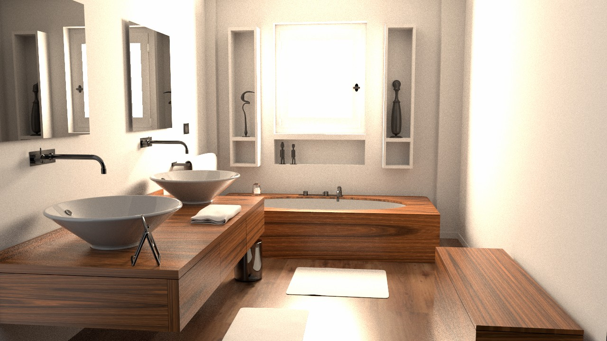
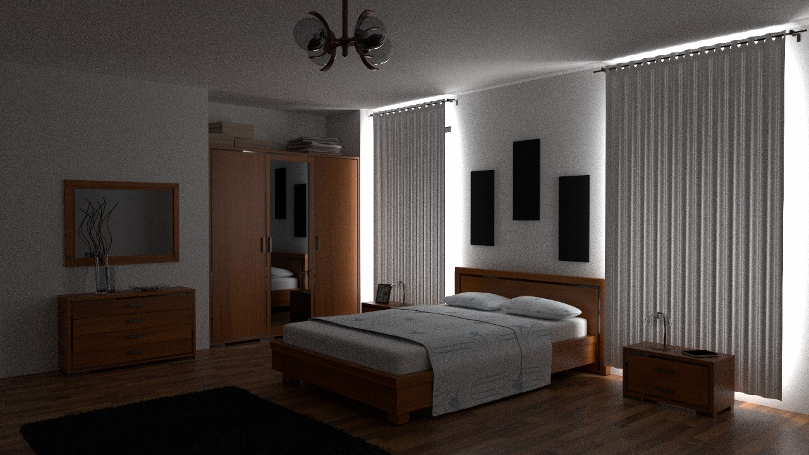
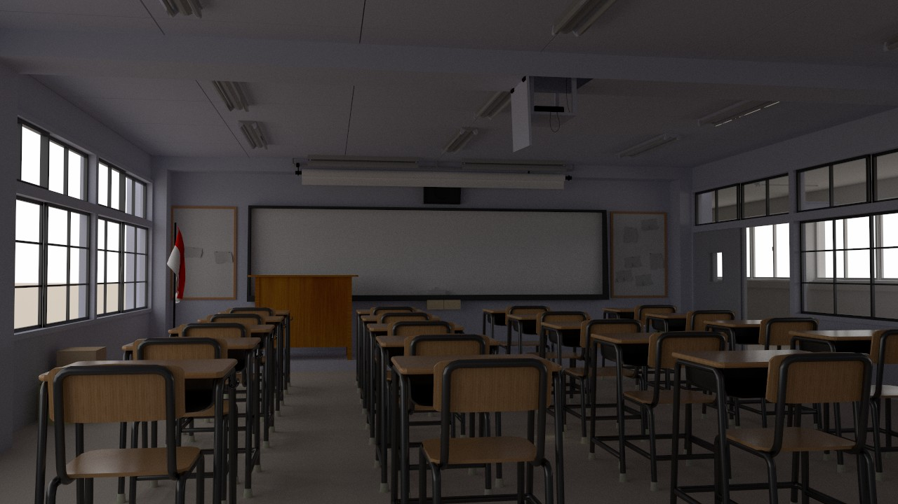
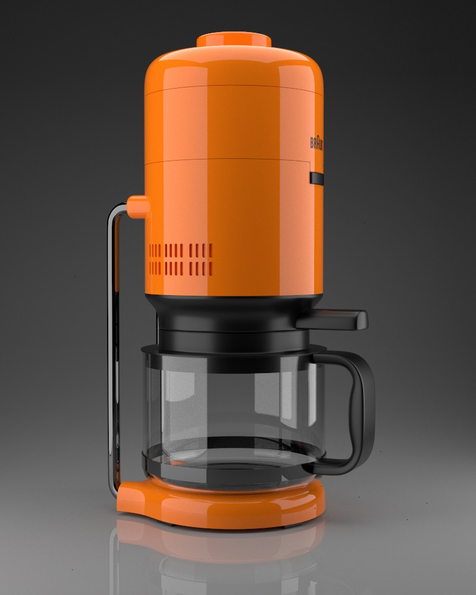
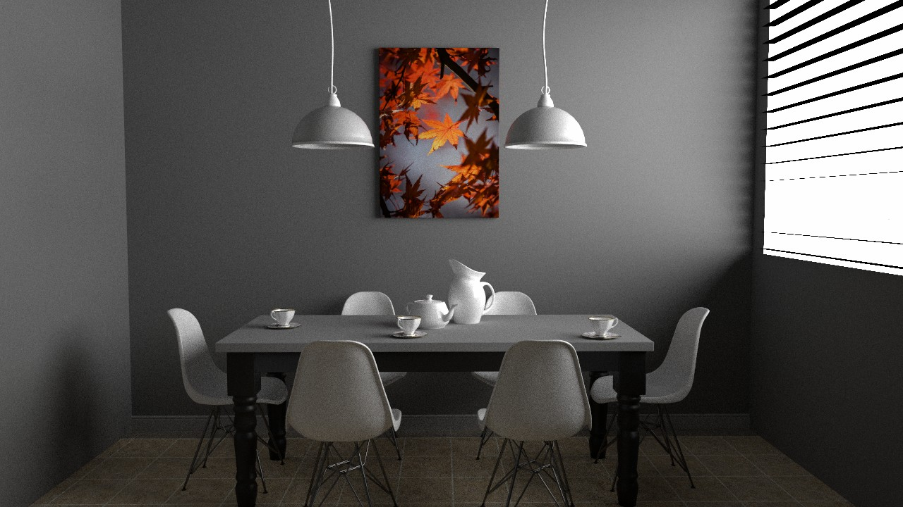
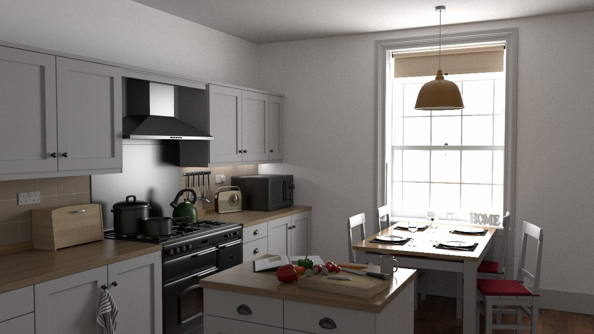
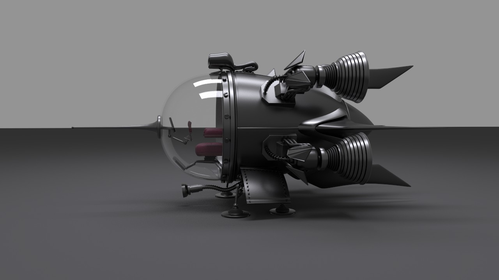
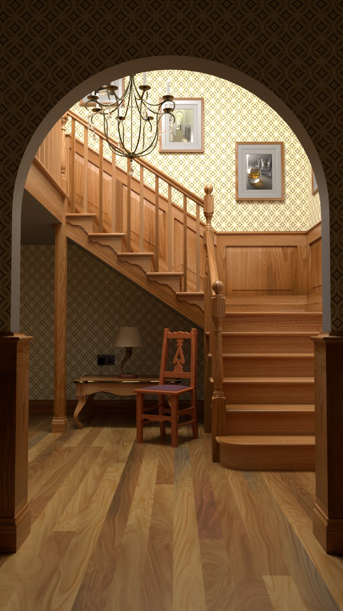
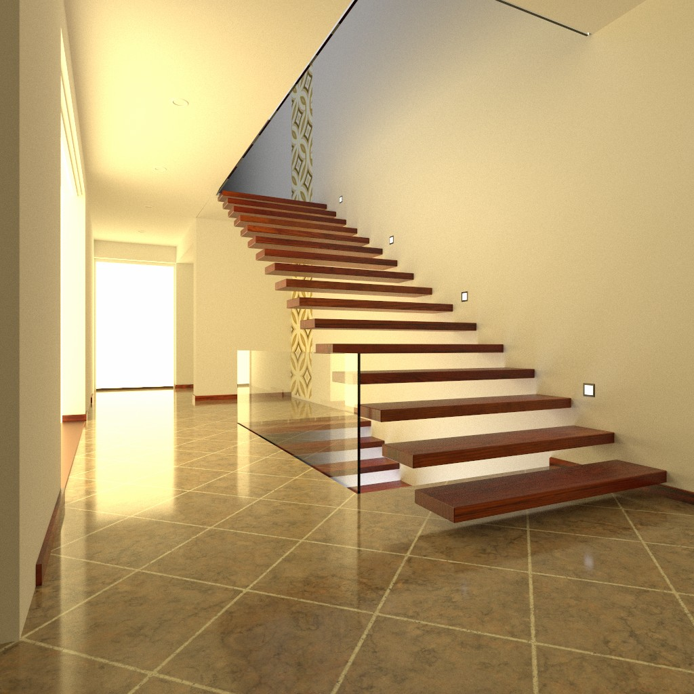

# Benchmark scenes
Set of scenes to compare rendering systems. Currently each scene has a version for HydraCore3, Mitsuba3, PBRTv4 and Luisa renderers.
Scenes were initially taken from [Rendering resources](https://benedikt-bitterli.me/resources/) and [LuisaRenderScenes](https://github.com/LuisaGroup/LuisaRenderScenes) and then modified to remove some of the features to increase similarity of rendered results between different rendering systems.

## Scenes

| Scene                                                             | Screenshot                                                          | Credits          |
|-------------------------------------------------------------------|:-------------------------------------------------------------------:|:-----------------|
| Bathroom [HydraCore3](https://disk.yandex.ru/d/iixlf3kUxq0Hsg/bathroom2) [Luisa](https://disk.yandex.ru/d/x2PI0DNghXvDKw/bathroom2) [Mitsuba3](https://disk.yandex.ru/d/U-NPzHucJQd_9w/bathroom2) [PBRT4](https://disk.yandex.ru/d/ad41cHbcg-nCvQ/bathroom2)            |                 | [nacimus](http://www.blendswap.com/users/view/nacimus) ([CC BY 3.0](https://creativecommons.org/licenses/by/3.0/)) |
| Bedroom [HydraCore3](https://disk.yandex.ru/d/iixlf3kUxq0Hsg/bedroom) [Luisa](https://disk.yandex.ru/d/x2PI0DNghXvDKw/bedroom) [Mitsuba3](https://disk.yandex.ru/d/U-NPzHucJQd_9w/bedroom) [PBRT4](https://disk.yandex.ru/d/ad41cHbcg-nCvQ/bedroom)               |                   |  [SlykDrako](http://www.blendswap.com/user/SlykDrako) (CC0) |
| Classroom [HydraCore3](https://disk.yandex.ru/d/iixlf3kUxq0Hsg/classroom) [Luisa](https://disk.yandex.ru/d/x2PI0DNghXvDKw/classroom) [Mitsuba3](https://disk.yandex.ru/d/U-NPzHucJQd_9w/classroom) [PBRT4](https://disk.yandex.ru/d/ad41cHbcg-nCvQ/classroom)   |             | [NovaZeeke](http://www.blendswap.com/users/view/NovaZeeke) ([CC BY 3.0](https://creativecommons.org/licenses/by/3.0/)) |
| Coffee [HydraCore3](https://disk.yandex.ru/d/iixlf3kUxq0Hsg/coffee) [Luisa](https://disk.yandex.ru/d/x2PI0DNghXvDKw/coffee) [Mitsuba3](https://disk.yandex.ru/d/U-NPzHucJQd_9w/coffee) [PBRT4](https://disk.yandex.ru/d/ad41cHbcg-nCvQ/coffee)   |             | [cekuhnen](http://www.blendswap.com/user/cekuhnen) ([CC BY 3.0](https://creativecommons.org/licenses/by/3.0/)) |
| Dining room [HydraCore3](https://disk.yandex.ru/d/iixlf3kUxq0Hsg/dining-room) [Luisa](https://disk.yandex.ru/d/x2PI0DNghXvDKw/dining-room) [Mitsuba3](https://disk.yandex.ru/d/U-NPzHucJQd_9w/dining-room) [PBRT4](https://disk.yandex.ru/d/ad41cHbcg-nCvQ/dining-room)   |             | [Wig42](http://www.blendswap.com/users/view/Wig42) ([CC BY 3.0](https://creativecommons.org/licenses/by/3.0/)) |
| Kitchen [HydraCore3](https://disk.yandex.ru/d/iixlf3kUxq0Hsg/kitchen) [Luisa](https://disk.yandex.ru/d/x2PI0DNghXvDKw/kitchen) [Mitsuba3](https://disk.yandex.ru/d/U-NPzHucJQd_9w/kitchen) [PBRT4](https://disk.yandex.ru/d/ad41cHbcg-nCvQ/kitchen)   |             | [Jay-Artist](http://www.blendswap.com/user/Jay-Artist) ([CC BY 3.0](https://creativecommons.org/licenses/by/3.0)) |
| Spaceship [HydraCore3](https://disk.yandex.ru/d/iixlf3kUxq0Hsg/spaceship) [Luisa](https://disk.yandex.ru/d/x2PI0DNghXvDKw/spaceship) [Mitsuba3](https://disk.yandex.ru/d/U-NPzHucJQd_9w/spaceship) [PBRT4](https://disk.yandex.ru/d/ad41cHbcg-nCvQ/spaceship)   |             | [thecali](http://www.blendswap.com/user/thecali) (CC0) |
| Staircase [HydraCore3](https://disk.yandex.ru/d/iixlf3kUxq0Hsg/staircase) [Luisa](https://disk.yandex.ru/d/x2PI0DNghXvDKw/staircase) [Mitsuba3](https://disk.yandex.ru/d/U-NPzHucJQd_9w/staircase) [PBRT4](https://disk.yandex.ru/d/ad41cHbcg-nCvQ/staircase)   |             | [Wig42](http://www.blendswap.com/users/view/Wig42) ([CC BY 3.0](https://creativecommons.org/licenses/by/3.0/)) |
| Staircase2 [HydraCore3](https://disk.yandex.ru/d/iixlf3kUxq0Hsg/staircase2) [Luisa](https://disk.yandex.ru/d/x2PI0DNghXvDKw/staircase2) [Mitsuba3](https://disk.yandex.ru/d/U-NPzHucJQd_9w/staircase2) [PBRT4](https://disk.yandex.ru/d/ad41cHbcg-nCvQ/staircase2)   |             | [NewSee2l035](http://www.blendswap.com/user/NewSee2l035) ([CC BY 3.0](https://creativecommons.org/licenses/by/3.0/)) |


For PBRT4 version of scene you would also need [common resources](https://disk.yandex.ru/d/Gj-98KoGjO3qyA) placed on the same level as your root scene dir, for example:
```
my_scenes    
│
└───pbrt4
│   │
│   └───bathroom
│       │   ...
│   └───bedroom
│       │   ...
│   
└───resources
    │   ...
```